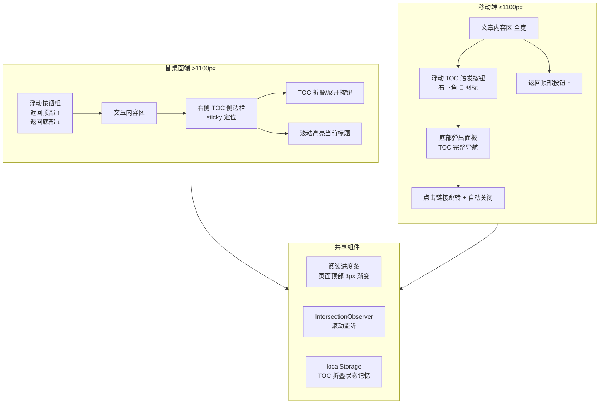

# 博客长文章阅读体验增强 — 技术方案文档

> 项目：Hugo 静态博客 | 主题风格：Stack / 毛玻璃 / 暗色模式
> 目标：解决长文章（如 面试准备最终版.md，66 个标题，961 行）阅读体验差的问题

---

## 一、现状分析

### 1.1 已有能力

| 功能 | 状态 | 所在文件 | 说明 |
|------|------|----------|------|
| 阅读进度条 | ✅ 已有 | `layouts/baseof.html:28` + CSS 129行 | 3px 渐变条，随滚动增长 |
| 返回顶部按钮 | ✅ 已有 | `layouts/baseof.html:35-37` + CSS 134-143行 | 右下角圆形按钮，>300px 显示 |
| 静态 TOC 侧边栏 | ⚠️ 基础版 | `layouts/_default/single.html:44-49` + CSS 244-251行 | Hugo 生成，仅当 >100 字符显示，无高亮追踪 |
| 暗色模式支持 | ✅ 已有 | `head-custom.html` 变量系统 | `[data-scheme="dark"]` 全覆盖 |
| 毛玻璃卡片 | ✅ 已有 | `.glass-card` 样式 | backdrop-filter blur |

### 1.2 明确的痛点

1. **TOC 是"死"的** — 纯静态 HTML，不会追踪当前阅读位置，不知道读到哪了
2. **TOC 在移动端消失** — `@media(max-width:1100px)` 直接 `display:none`，手机用户完全无导航
3. **只有返回顶部，没有返回底部** — 长文章需要跳到底部看评论区/上下篇导航
4. **TOC 不可折叠** — 66 个标题的 TOC 太长，占据侧边栏大量空间

### 1.3 目标文章结构特征

以 [`content/post/面试准备最终版.md`](content/post/面试准备最终版.md) 为例：
- **2 个 h1**：智枢项目、AgentForge 智能体编排引擎
- **13 个 h2**：🔴核心、🟡中等、🟢低优先级、一~十一等
- **51 个 h3**：具体面试问题
- 总计 **66 个标题**，文章约 961 行

### 1.4 与现有功能的兼容性矩阵

| 现有功能 | 运行页面 | 冲突风险 | 说明 |
|----------|----------|----------|------|
| 首页侧边栏过滤（分类/标签） | 仅首页 | 无 | `is-home` 类隔离，新功能仅在文章页激活 |
| 搜索弹窗 | 非首页 | 无 | 搜索弹窗 z-index=2000，TOC 面板 z-index=1500 |
| 暗色模式切换 | 全站 | 无 | 新组件使用 CSS 变量，自动适配 |
| 视频背景 | 全站 | 无 | 固定定位 z-index=-1，不冲突 |

---

## 二、总体架构



---

## 三、组件详细设计

### 3.1 增强版 TOC 侧边栏（桌面端）

#### 涉及文件

| 操作 | 文件 | 说明 |
|------|------|------|
| **修改** | [`layouts/_default/single.html`](layouts/_default/single.html) | 重构 TOC HTML 结构，添加折叠按钮、包裹层 |
| **修改** | [`layouts/partials/custom/head-custom.html`](layouts/partials/custom/head-custom.html) | 新增 TOC 增强样式（约 60 行 CSS） |
| **修改** | [`layouts/baseof.html`](layouts/baseof.html) | 新增 TOC 交互 JS（约 80 行） |

#### HTML 结构变更（`single.html` 第 44-49 行替换）

```html
{{ if $hasToc }}
<aside class="toc-card glass-card" id="toc-sidebar">
    <div class="toc-header">
        <h3 class="toc-title">📑 目录</h3>
        <button class="toc-collapse-btn" id="toc-collapse-btn" 
                aria-label="折叠目录" title="折叠/展开目录">
            <svg class="toc-collapse-icon" width="16" height="16" viewBox="0 0 24 24" 
                 fill="none" stroke="currentColor" stroke-width="2.5" 
                 stroke-linecap="round">
                <polyline points="18 15 12 9 6 15"/>
            </svg>
        </button>
    </div>
    <div class="toc-nav-wrapper" id="toc-nav-wrapper">
        {{ .TableOfContents }}
    </div>
</aside>
{{ end }}
```

**关键设计决策：**
- 保留 Hugo 的 `.TableOfContents` 输出，不做自定义生成 — 保证 SEO（TOC 在服务端渲染）同时减少维护成本
- JS 在运行时遍历 `#TableOfContents` 内的所有 `<a>` 标签，添加 `.toc-link` 类名和 `data-level` 属性
- 折叠按钮旋转 SVG 动画（折叠时箭头向下，展开时向上）

#### CSS 设计要点

```css
/* TOC 容器增强 */
.toc-card {
    position: sticky;
    top: var(--content-top);
    max-height: calc(100vh - var(--content-top) - 32px);
    display: flex;
    flex-direction: column;
    overflow: hidden;  /* 配合内部滚动 */
}
.toc-header {
    display: flex;
    align-items: center;
    justify-content: space-between;
    padding-bottom: 10px;
    border-bottom: 1px solid var(--c-bd);
    flex-shrink: 0;
}
.toc-title { margin: 0; font-size: .98rem; font-weight: 700; }

/* 折叠按钮 */
.toc-collapse-btn {
    width: 28px; height: 28px;
    border-radius: 50%;
    border: 1px solid var(--c-bd);
    background: transparent;
    color: var(--t2);
    cursor: pointer;
    display: flex; align-items: center; justify-content: center;
    transition: all .25s;
}
.toc-collapse-btn:hover { 
    background: rgba(59,130,246,.08); 
    color: var(--accent); 
}
.toc-collapse-icon { transition: transform .3s; }
.toc-card.collapsed .toc-collapse-icon { transform: rotate(180deg); }

/* 折叠状态 */
.toc-card.collapsed .toc-nav-wrapper { display: none; }
.toc-card.collapsed { max-height: none; }

/* 导航容器 */
.toc-nav-wrapper {
    overflow-y: auto;
    flex: 1;
    padding-top: 8px;
    scroll-behavior: smooth;
}

/* TOC 链接层级样式 */
.toc-nav-wrapper a {
    display: block;
    padding: 4px 8px;
    border-radius: 4px;
    color: var(--t2);
    text-decoration: none;
    font-size: .85rem;
    transition: all .2s;
    border-left: 2px solid transparent;
}
.toc-nav-wrapper a:hover {
    color: var(--accent);
    background: rgba(59,130,246,.05);
}

/* 当前激活标题 — 高亮 */
.toc-nav-wrapper a.active {
    color: var(--accent);
    font-weight: 600;
    background: rgba(59,130,246,.08);
    border-left-color: var(--accent);
}

/* h2 级别缩进 */
.toc-nav-wrapper ul ul li > a { padding-left: 20px; font-size: .82rem; }
/* h3 级别缩进 */
.toc-nav-wrapper ul ul ul li > a { padding-left: 34px; font-size: .78rem; }
```

#### JS 逻辑设计

```
初始化流程:
┌─────────────────────────────────────────────────┐
│ 1. 找到 #TableOfContents 中所有 <a> 标签        │
│ 2. 为每个 <a> 添加 .toc-link class              │
│ 3. 根据嵌套深度添加 data-level="h1|h2|h3"       │
│ 4. 建立 href → DOM heading 元素的映射表          │
│ 5. 创建 IntersectionObserver 监听所有标题        │
│ 6. 恢复 localStorage 中的折叠状态               │
└─────────────────────────────────────────────────┘

IntersectionObserver 回调:
┌─────────────────────────────────────────────────┐
│ 当标题进入/离开视口时:                           │
│ 1. 找到所有可见标题中位于视口最顶部的一个         │
│ 2. 移除所有 .toc-link 的 .active 类             │
│ 3. 给对应标题的 .toc-link 添加 .active          │
│ 4. 自动滚动 TOC 面板使 active 链接保持可见       │
│    (scrollIntoView with block:'nearest')        │
└─────────────────────────────────────────────────┘

折叠按钮:
┌─────────────────────────────────────────────────┐
│ 1. 点击切换 .collapsed class                    │
│ 2. 保存状态到 localStorage('toc-collapsed')     │
│ 3. CSS transition 处理折叠动画                  │
└─────────────────────────────────────────────────┘
```

**关键技术选择 — IntersectionObserver vs scroll 事件：**
- `IntersectionObserver` 性能远优于 `scroll` 事件（浏览器原生优化，不阻塞主线程）
- 使用 `rootMargin: '-80px 0px -70% 0px'` 使得标题在接近顶部 80px 时即被标记为"当前"
- `threshold: [0, 0.25, 0.5, 0.75, 1]` 多阈值确保平滑切换

---

### 3.2 浮动按钮组（返回顶部 + 返回底部）

#### 涉及文件

| 操作 | 文件 | 说明 |
|------|------|------|
| **修改** | [`layouts/baseof.html`](layouts/baseof.html) | 用 `.floating-actions` 包裹两个按钮，新增返回底部按钮 |
| **修改** | [`layouts/partials/custom/head-custom.html`](layouts/partials/custom/head-custom.html) | 重构按钮样式为按钮组，新增返回底部样式 |

#### HTML 结构变更（`baseof.html` 第 35-37 行替换）

```html
<div class="floating-actions" id="floating-actions">
    <button class="back-to-top" id="back-to-top" aria-label="回到顶部">
        <svg xmlns="http://www.w3.org/2000/svg" width="22" height="22" viewBox="0 0 24 24" 
             fill="none" stroke="currentColor" stroke-width="2.5" 
             stroke-linecap="round" stroke-linejoin="round">
            <polyline points="18 15 12 9 6 15"/>
        </svg>
    </button>
    <button class="back-to-bottom" id="back-to-bottom" aria-label="到达底部">
        <svg xmlns="http://www.w3.org/2000/svg" width="22" height="22" viewBox="0 0 24 24" 
             fill="none" stroke="currentColor" stroke-width="2.5" 
             stroke-linecap="round" stroke-linejoin="round">
            <polyline points="6 9 12 15 18 9"/>
        </svg>
    </button>
</div>
```

#### CSS 设计要点

```css
/* 按钮组容器 — 替换原有的 .back-to-top 独立定位 */
.floating-actions {
    position: fixed;
    bottom: 32px;
    right: 32px;
    z-index: 999;
    display: flex;
    flex-direction: column;
    gap: 8px;
}

/* 两个按钮共用基础样式 */
.back-to-top, .back-to-bottom {
    width: 44px; height: 44px;
    border-radius: 50%;
    border: none;
    background: var(--grad);
    color: #fff;
    cursor: pointer;
    display: flex;
    align-items: center;
    justify-content: center;
    box-shadow: 0 4px 18px rgba(59,130,246,.3);
    opacity: 0;
    visibility: hidden;
    transform: translateY(12px);
    transition: all .3s;
}
.back-to-top.show, .back-to-bottom.show {
    opacity: 1;
    visibility: visible;
    transform: translateY(0);
}
.back-to-top:hover, .back-to-bottom:hover {
    transform: translateY(-3px);
    box-shadow: 0 6px 24px rgba(59,130,246,.4);
}

/* 移动端适配 */
@media (max-width: 768px) {
    .floating-actions {
        bottom: 20px;
        right: 16px;
        gap: 6px;
    }
    .back-to-top, .back-to-bottom {
        width: 40px; height: 40px;
    }
    .back-to-top svg, .back-to-bottom svg {
        width: 18px; height: 18px;
    }
}
```

#### JS 逻辑设计

```
返回顶部按钮:
  显示条件: scrollY > 300px
  行为: window.scrollTo({top: 0, behavior: 'smooth'})

返回底部按钮:
  显示条件: scrollY > 300px AND 未到达底部
  隐藏条件: 距离底部 < 100px（已到达底部）
  行为: window.scrollTo({top: documentHeight, behavior: 'smooth'})

两按钮使用同一个 scroll 事件监听器（passive: true）控制显示/隐藏
```

**与现有 JS 的整合位置：** 在 `baseof.html` 中替换第 87-92 行的返回顶部逻辑块。

---

### 3.3 移动端 TOC 底部弹出面板

#### 涉及文件

| 操作 | 文件 | 说明 |
|------|------|------|
| **修改** | [`layouts/baseof.html`](layouts/baseof.html) | 在 page-wrapper 后添加 TOC 触发按钮 + 底部弹出面板 HTML |
| **修改** | [`layouts/partials/custom/head-custom.html`](layouts/partials/custom/head-custom.html) | 新增移动端 TOC 全部样式（约 70 行 CSS） |
| **修改** | [`layouts/baseof.html`](layouts/baseof.html) | JS 逻辑与桌面 TOC 共享 scroll-spy，额外处理面板开/关 |

#### HTML 结构（新增到 `baseof.html` 的 `</body>` 前）

```html
<!-- 仅文章页有 TOC 时渲染，通过 Hugo 条件控制 -->
{{ if and (eq .Kind "page") (eq .Section "post") .TableOfContents }}
<button class="mobile-toc-toggle" id="mobile-toc-toggle" aria-label="目录导航">
    <svg width="22" height="22" viewBox="0 0 24 24" fill="none" 
         stroke="currentColor" stroke-width="2" stroke-linecap="round">
        <line x1="8" y1="6" x2="21" y2="6"/><line x1="8" y1="12" x2="21" y2="12"/>
        <line x1="8" y1="18" x2="21" y2="18"/><line x1="3" y1="6" x2="3.01" y2="6"/>
        <line x1="3" y1="12" x2="3.01" y2="12"/><line x1="3" y1="18" x2="3.01" y2="18"/>
    </svg>
</button>

<div class="mobile-toc-overlay" id="mobile-toc-overlay"></div>
<div class="mobile-toc-sheet" id="mobile-toc-sheet">
    <div class="mobile-toc-handle"></div>
    <div class="mobile-toc-header">
        <span class="mobile-toc-heading">📑 文章目录</span>
        <button class="mobile-toc-close" id="mobile-toc-close" aria-label="关闭目录">
            <svg width="20" height="20" viewBox="0 0 24 24" fill="none" 
                 stroke="currentColor" stroke-width="2.5" stroke-linecap="round">
                <line x1="18" y1="6" x2="6" y2="18"/><line x1="6" y1="6" x2="18" y2="18"/>
            </svg>
        </button>
    </div>
    <div class="mobile-toc-content" id="mobile-toc-content">
        <!-- JS 动态克隆桌面 TOC 内容填充 -->
    </div>
</div>
{{ end }}
```

#### CSS 设计要点

```css
/* ===========================================
   移动端 TOC 触发按钮
   =========================================== */
.mobile-toc-toggle {
    display: none;  /* 默认隐藏，移动端媒体查询中显示 */
    position: fixed;
    bottom: 120px;   /* 在返回顶部按钮上方 */
    right: 16px;
    z-index: 998;
    width: 42px; height: 42px;
    border-radius: 50%;
    border: 1px solid var(--c-bd);
    background: var(--s-bg);
    backdrop-filter: blur(14px);
    -webkit-backdrop-filter: blur(14px);
    color: var(--t2);
    cursor: pointer;
    align-items: center;
    justify-content: center;
    box-shadow: 0 4px 16px rgba(0,0,0,.08);
    transition: all .25s;
}
.mobile-toc-toggle:hover, .mobile-toc-toggle:active {
    color: var(--accent);
    border-color: var(--accent);
    transform: scale(1.05);
}

/* ===========================================
   移动端 TOC 底部弹出面板
   =========================================== */
.mobile-toc-overlay {
    position: fixed; inset: 0;
    z-index: 1499;
    background: rgba(0,0,0,.35);
    opacity: 0; visibility: hidden;
    transition: all .3s;
}
.mobile-toc-overlay.active { opacity: 1; visibility: visible; }

.mobile-toc-sheet {
    position: fixed;
    bottom: 0; left: 0; right: 0;
    z-index: 1500;
    background: var(--s-bg);
    backdrop-filter: blur(24px);
    -webkit-backdrop-filter: blur(24px);
    border-radius: var(--r) var(--r) 0 0;
    max-height: 65vh;
    display: flex;
    flex-direction: column;
    transform: translateY(100%);
    transition: transform .35s cubic-bezier(.4,0,.2,1);
    box-shadow: 0 -8px 40px rgba(0,0,0,.12);
}
.mobile-toc-sheet.active { transform: translateY(0); }

/* 拖拽手柄（视觉提示） */
.mobile-toc-handle {
    width: 36px; height: 4px;
    background: var(--c-bd);
    border-radius: 2px;
    margin: 10px auto 4px;
    flex-shrink: 0;
}

.mobile-toc-header {
    display: flex;
    align-items: center;
    justify-content: space-between;
    padding: 12px 20px 8px;
    border-bottom: 1px solid var(--c-bd);
    flex-shrink: 0;
}
.mobile-toc-heading { font-size: 1.05rem; font-weight: 700; color: var(--t1); }
.mobile-toc-close {
    width: 32px; height: 32px;
    border-radius: 50%;
    border: none;
    background: rgba(0,0,0,.04);
    color: var(--t2);
    cursor: pointer;
    display: flex; align-items: center; justify-content: center;
    transition: all .2s;
}
.mobile-toc-close:hover { background: rgba(59,130,246,.1); color: var(--accent); }

.mobile-toc-content {
    overflow-y: auto;
    padding: 12px 20px 24px;
    flex: 1;
    -webkit-overflow-scrolling: touch;
}
/* 复用桌面 TOC 的链接样式 */
.mobile-toc-content a {
    display: block;
    padding: 8px 10px;
    border-radius: 6px;
    color: var(--t2);
    text-decoration: none;
    font-size: .92rem;
    transition: all .15s;
    border-left: 2px solid transparent;
}
.mobile-toc-content a.active {
    color: var(--accent);
    font-weight: 600;
    background: rgba(59,130,246,.08);
    border-left-color: var(--accent);
}
.mobile-toc-content a:active { background: rgba(59,130,246,.12); }

/* 移动端媒体查询扩展 */
@media (max-width: 1100px) {
    .mobile-toc-toggle { display: flex; }
}
@media (min-width: 1101px) {
    .mobile-toc-toggle, .mobile-toc-overlay, .mobile-toc-sheet { display: none !important; }
}
```

#### JS 逻辑设计

```
移动端 TOC 面板:
┌─────────────────────────────────────────────────┐
│ 打开:                                            │
│ 1. 点击 mobile-toc-toggle 或从 navbar 触发       │
│ 2. 克隆桌面 TOC 内容到 mobile-toc-content       │
│ 3. 添加 .active 到 overlay + sheet              │
│ 4. 锁定 body 滚动 (overflow:hidden)             │
│ 5. 滚动 mobile-toc-content 使当前标题可见        │
│                                                  │
│ 关闭:                                            │
│ 1. 点击关闭按钮 / overlay / 按 ESC               │
│ 2. 移除 .active class                           │
│ 3. 恢复 body 滚动                                │
│                                                  │
│ 点击链接后:                                      │
│ 1. 平滑滚动到目标标题                            │
│ 2. 自动关闭面板                                  │
│ 3. 标题高亮自然由 IntersectionObserver 接管      │
└─────────────────────────────────────────────────┘

拖拽关闭（可选增强）:
- 监听 touchstart/touchmove/touchend
- 向下拖拽 > 80px 时关闭面板
- 低优先级，基础版本可省略
```

**为什么克隆桌面 TOC 而不是重新生成？**
- 避免重复的 DOM 查询和构建逻辑
- 桌面和移动端共享同一套 `.active` 状态管理
- 减少 JS 代码量

---

### 3.4 阅读进度条（增强）

#### 现状

[`baseof.html:28`](layouts/baseof.html:28) 已有 3px 渐变进度条，JS 逻辑在第 79-84 行。功能完整，无需大改。

#### 可选的微增强（低优先级）

- 滚动到页面 80% 位置后进度条颜色变暖（暗示"快读完了"）
- 在 TOC 中同步标记"读过的章节"（用半透明 `.read` 样式）

**建议**：本次迭代保持进度条不变，避免过度设计。上述增强可留作 v2。

---

## 四、文件修改清单汇总

| # | 文件 | 操作 | 修改量 | 说明 |
|---|------|------|--------|------|
| 1 | [`layouts/_default/single.html`](layouts/_default/single.html) | 修改 | ~10 行 | 重构 TOC 侧边栏 HTML（添加折叠按钮、包裹容器） |
| 2 | [`layouts/baseof.html`](layouts/baseof.html) | 修改 | ~70 行 | ① 返回底部按钮 HTML ② 移动端 TOC HTML ③ 文章页 JS 增强逻辑 |
| 3 | [`layouts/partials/custom/head-custom.html`](layouts/partials/custom/head-custom.html) | 修改 | ~150 行 | ① 增强 TOC 样式 ② 浮动按钮组样式 ③ 移动端 TOC 样式 ④ 响应式适配 |

**无需新建文件** — 所有改动均嵌入现有文件，保持项目结构简洁。

---

## 五、JS 整合架构

所有 JS 统一写在 `baseof.html` 的现有 `<script>` 标签内（第 39-218 行之后追加），复用已有的变量（`isHome`, `rpb`, `btt` 等）。

### 新增 JS 模块结构

```javascript
/* ========== 文章页阅读增强 ========== */
var articleContent = document.querySelector('.article-content');
if (articleContent && !isHome) {
    
    /* -- 模块 A: TOC 增强 -- */
    var tocSidebar = document.getElementById('toc-sidebar');
    var tocNav = document.querySelector('#TableOfContents');
    if (tocNav && tocSidebar) {
        // A1. 初始化：给 TOC 链接添加 class 和 data 属性
        // A2. 建立 href → heading DOM 元素的映射
        // A3. IntersectionObserver 滚动监听
        // A4. TOC 折叠/展开（含 localStorage 状态记忆）
    }
    
    /* -- 模块 B: 返回底部按钮 -- */
    var btb = document.getElementById('back-to-bottom');
    if (btb) {
        // B1. scroll 事件控制 show/hide
        // B2. click → smooth scroll to bottom
    }
    
    /* -- 模块 C: 移动端 TOC 面板 -- */
    var mtToggle = document.getElementById('mobile-toc-toggle');
    var mtSheet  = document.getElementById('mobile-toc-sheet');
    var mtOverlay = document.getElementById('mobile-toc-overlay');
    var mtClose  = document.getElementById('mobile-toc-close');
    var mtContent = document.getElementById('mobile-toc-content');
    if (mtToggle && mtSheet) {
        // C1. 打开面板：克隆桌面 TOC → 显示 → 锁定滚动
        // C2. 关闭面板：隐藏 → 解锁滚动
        // C3. 点击链接 → 跳转 + 自动关闭
        // C4. ESC 键关闭
        // C5. 点击 overlay 关闭
    }
}
```

### 与现有 JS 的共存

| 现有 JS 区块 | 行号 | 影响 |
|--------------|------|------|
| 导航栏滚动 | 59-61 | 无影响 |
| 暗色模式切换 | 64-68 | 无影响 |
| 移动端菜单 | 71-76 | 无影响 |
| 阅读进度条 | 79-84 | **需要修改**：`!isHome` 条件保持不变 |
| 返回顶部 | 87-92 | **需要重构**：改为按钮组逻辑，需同时管理两个按钮 |
| 首页过滤逻辑 | 95-178 | 无影响（受 `isHome` 保护） |
| 搜索弹窗 | 180-217 | 无影响（z-index 隔离） |

**关键整合点：** 返回顶部/底部按钮的 scroll 监听器合并为一个，避免两个独立的 scroll 事件。

---

## 六、响应式策略

```
视口宽度               布局策略
═══════════════════════════════════════════════════════
> 1100px               双栏布局：文章(1fr) + TOC侧边栏(220px)
                       浮动按钮组：右下角固定
                       移动端组件：完全隐藏

768px ~ 1100px         单栏布局：文章全宽 + TOC隐藏
                       浮动 TOC 按钮：显示（右下角）
                       底部弹出面板：可用
                       浮动按钮组：显示

< 768px                单栏布局：文章全宽 + padding缩小
                       浮动 TOC 按钮：显示
                       底部弹出面板：可用（占65vh）
                       浮动按钮组：缩小至40px
                       视频背景：切换为静态图
```

**断点说明：**
- 1100px 是现有 TOC 隐藏断点（`head-custom.html:333`），保持不变
- 768px 是现有移动端断点（`head-custom.html:340`），保持不变
- 新增的移动端 TOC 组件在 ≤1100px 时激活，完全匹配原有响应式策略

---

## 七、暗色模式适配

所有新组件使用 CSS 变量而非硬编码颜色，自动继承 `[data-scheme="dark"]` 的变量覆盖：

| 组件 | 使用的 CSS 变量 | 暗色模式行为 |
|------|-----------------|-------------|
| TOC 侧边栏 | `--c-bg`, `--c-bd`, `--t1`, `--t2` | 自动切换到深色半透明背景 |
| 浮动按钮 | `--grad` (渐变色不变) | 按钮使用固定渐变色，白色文字 |
| 移动端 TOC | `--s-bg`, `--c-bd`, `--t1`, `--t2` | 深色毛玻璃面板 |
| 高亮 active 状态 | `--accent`, `rgba(59,130,246,.08)` | accent 色不变，半透明层自适应 |

无需额外编写 `[data-scheme="dark"]` 专属样式。

---

## 八、实施顺序建议

```
第1步: 修改 head-custom.html — 添加所有新 CSS
       ↓ (不影响现有功能，纯增量)
第2步: 修改 single.html — 重构 TOC HTML 结构
       ↓ (TOC 变为可折叠，但尚无 JS 交互)
第3步: 修改 baseof.html — 添加按钮组 + 移动端 TOC HTML
       ↓ (新按钮出现但无交互)
第4步: 修改 baseof.html — 添加/重构 JS 逻辑
       ↓ (所有交互激活)
第5步: Hugo 编译测试，在浏览器中验证
       ↓ (检查桌面端/移动端/暗色模式)
第6步: 用面试准备最终版.md 做完整回归测试
```

---

## 九、潜在风险与注意事项

| 风险 | 影响 | 缓解措施 |
|------|------|----------|
| Hugo TOC 生成的 HTML 结构变化（主题升级） | TOC 增强 JS 失效 | JS 添加防御性检查，找不到元素时静默退出 |
| IntersectionObserver 不兼容老旧浏览器 | 无滚动高亮 | 已有 `<meta charset>` 和现代浏览器目标用户群体，可接受 |
| 浮动按钮遮挡页面内容 | 底部元素被盖住 | 给 `article-content` 添加 `padding-bottom: 80px` 安全区 |
| 移动端底部面板与 iOS Safari 底部栏冲突 | 面板被遮挡 | 使用 `env(safe-area-inset-bottom)` 增加底部内边距 |
| 大型 TOC（66 标题）在移动端面板中性能 | 克隆内容卡顿 | 仅克隆一次（打开时），缓存在内存中 |

---

## 十、待确认事项

以下点需要用户确认后实施：

1. **移动端底部面板高度**：建议 65vh，是否需要调整？
2. **浮动按钮组位置**：桌面端 `right: 32px`，如果 TOC 侧边栏展开且屏幕宽度刚好 ≥1100px 时可能有轻微重叠，是否接受？
3. **TOC 折叠状态默认**：建议默认展开，用户手动折叠后记忆。是否需要默认折叠？
4. **返回底部按钮显示逻辑**：建议在页面 80% 以上已阅读时隐藏（因为底部导航已可见）。是否需要调整阈值？
